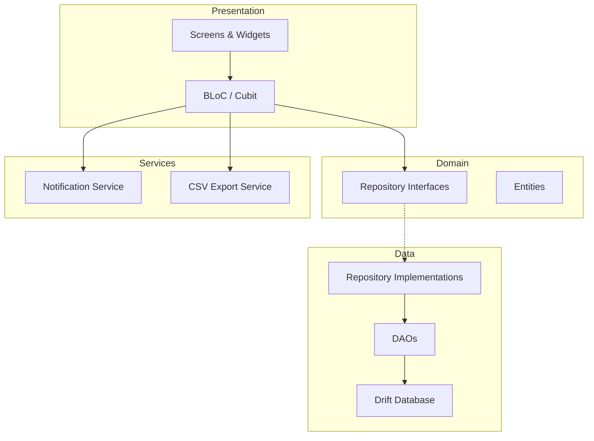

# Expense & Spending Tracker — Implementation Plan

A premium Flutter mobile app for tracking expenses, managing budgets, scheduling tasks, and visualizing spending patterns. Built with a clean architecture that supports seamless future migration from local storage to cloud.

---

## Confirmed Decisions

| Decision | Choice |
|----------|--------|
| **Navigation** | Bottom nav bar — 4 tabs (Home, Analytics, Schedule, Settings) + FAB |
| **Budget Reset** | Monthly only for v1 |
| **Recurrence** | None / Daily / Weekly / Monthly / Yearly |
| **Data Migration** | One-time sync: local Drift → cloud (Firestore/Supabase). Repository pattern = zero UI changes. All existing user data is preserved. |

---

## Architecture Overview



**Key Design Decisions:**
- **Repository Pattern** — Abstract interfaces in `domain/`, concrete Drift implementations in `data/`. Swapping to Firestore/Supabase later means only writing new implementations, zero UI changes.
- **BLoC** — One Cubit/BLoC per feature (HomeCubit, AnalyticsCubit, ScheduleCubit, SettingsCubit, etc.)
- **Drift** — Type-safe SQL with code generation. Schema maps directly to cloud database tables.

---

## Design System

### Color Palette

| Token | Light Mode | Dark Mode | Usage |
|-------|-----------|-----------|-------|
| **Primary** | `#6366F1` (Indigo 500) | `#818CF8` (Indigo 400) | Buttons, active nav, headers |
| **Secondary** | `#10B981` (Emerald 500) | `#34D399` (Emerald 400) | Income indicators, success |
| **Surface** | `#FFFFFF` | `#1E293B` (Slate 800) | Cards, sheets |
| **Background** | `#F8FAFC` (Slate 50) | `#0F172A` (Slate 900) | Page background |
| **Warning** | `#F59E0B` (Amber 500) | `#FBBF24` (Amber 400) | Over-budget warnings |
| **Danger** | `#EF4444` (Red 500) | `#F87171` (Red 400) | Budget exceeded, alerts |
| **Text Primary** | `#0F172A` | `#F1F5F9` | Headings |
| **Text Secondary** | `#64748B` | `#94A3B8` | Subtitles, labels |

### Typography
- **Font:** Google Fonts — `Inter` (clean, modern, excellent number readability)
- **Headings:** Semi-bold / Bold
- **Body:** Regular / Medium

### Iconography
- `lucide_icons` or `hugeicons` package for a consistent, modern icon set

---

## Project Structure

```
lib/
├── main.dart                          # Entry point, DI init
├── app.dart                           # MaterialApp, theme, routing
│
├── core/
│   ├── constants/
│   │   ├── app_constants.dart         # Time-of-day ranges, defaults
│   │   └── category_defaults.dart     # Default categories
│   ├── theme/
│   │   ├── app_theme.dart             # Light & dark ThemeData
│   │   ├── app_colors.dart            # Color tokens
│   │   └── app_typography.dart        # Text styles
│   ├── utils/
│   │   ├── date_utils.dart            # Date formatting, time-of-day calc
│   │   ├── currency_formatter.dart    # Format amounts with user currency
│   │   └── csv_exporter.dart          # CSV generation logic
│   └── di/
│       └── injection.dart             # GetIt service locator setup
│
├── data/
│   ├── database/
│   │   ├── app_database.dart          # Drift database class
│   │   ├── app_database.g.dart        # Generated
│   │   └── tables/
│   │       ├── expenses_table.dart
│   │       ├── categories_table.dart
│   │       ├── tasks_table.dart
│   │       ├── budgets_table.dart
│   │       └── settings_table.dart
│   ├── daos/
│   │   ├── expense_dao.dart
│   │   ├── category_dao.dart
│   │   ├── task_dao.dart
│   │   ├── budget_dao.dart
│   │   └── settings_dao.dart
│   └── repositories/
│       ├── expense_repository_impl.dart
│       ├── category_repository_impl.dart
│       ├── task_repository_impl.dart
│       ├── budget_repository_impl.dart
│       └── settings_repository_impl.dart
│
├── domain/
│   ├── entities/
│   │   ├── expense.dart
│   │   ├── category.dart
│   │   ├── task.dart
│   │   ├── budget.dart
│   │   └── time_of_day_tag.dart       # Enum: Morning, Noon, Evening, Night
│   └── repositories/
│       ├── expense_repository.dart     # Abstract
│       ├── category_repository.dart
│       ├── task_repository.dart
│       ├── budget_repository.dart
│       └── settings_repository.dart
│
├── presentation/
│   ├── onboarding/
│   │   ├── screens/
│   │   │   └── currency_setup_screen.dart
│   │   └── cubit/
│   │       ├── onboarding_cubit.dart
│   │       └── onboarding_state.dart
│   │
│   ├── home/
│   │   ├── screens/
│   │   │   └── home_screen.dart
│   │   ├── widgets/
│   │   │   ├── budget_progress_card.dart   # Progress bar + warning
│   │   │   ├── category_pie_chart.dart     # Donut chart
│   │   │   ├── next_up_card.dart           # Today + next scheduled
│   │   │   ├── trend_chart.dart            # 7d/30d/1y line graph
│   │   │   └── category_alert_strip.dart   # Over-limit category alerts
│   │   └── cubit/
│   │       ├── home_cubit.dart
│   │       └── home_state.dart
│   │
│   ├── analytics/
│   │   ├── screens/
│   │   │   ├── analytics_screen.dart       # Main list view
│   │   │   └── category_detail_screen.dart # Drill-down
│   │   ├── widgets/
│   │   │   ├── expense_record_tile.dart    # With time-of-day tag
│   │   │   ├── date_filter_bar.dart        # Date range picker
│   │   │   └── search_bar_widget.dart
│   │   └── cubit/
│   │       ├── analytics_cubit.dart
│   │       └── analytics_state.dart
│   │
│   ├── schedule/
│   │   ├── screens/
│   │   │   └── schedule_screen.dart
│   │   ├── widgets/
│   │   │   ├── expense_form.dart           # Add expense form
│   │   │   ├── task_form.dart              # Add task form
│   │   │   ├── importance_selector.dart    # Low/Med/High chips
│   │   │   ├── recurrence_picker.dart
│   │   │   └── reminder_input.dart
│   │   └── cubit/
│   │       ├── schedule_cubit.dart
│   │       └── schedule_state.dart
│   │
│   ├── settings/
│   │   ├── screens/
│   │   │   ├── settings_screen.dart
│   │   │   ├── category_management_screen.dart
│   │   │   └── budget_settings_screen.dart
│   │   └── cubit/
│   │       ├── settings_cubit.dart
│   │       └── settings_state.dart
│   │
│   ├── navigation/
│   │   └── app_shell.dart                  # Bottom nav + FAB scaffold
│   │
│   └── shared/
│       ├── widgets/
│       │   ├── animated_fab.dart
│       │   ├── glassmorphic_card.dart       # Reusable glass card
│       │   ├── shimmer_loading.dart
│       │   └── empty_state_widget.dart
│       └── cubit/
│           ├── theme_cubit.dart
│           └── theme_state.dart
│
└── services/
    ├── notification_service.dart            # flutter_local_notifications
    └── csv_export_service.dart
```

---

## Database Schema

### `categories` table

> [!NOTE]
> **Per-category budget:** Stored directly in `budget_limit` on this table. When a user sets a spend limit for "Food", that value is written here. The Home screen reads it alongside the sum of expenses for that category to compute the usage percentage and trigger color alerts.
>
> **`is_system` vs `is_default`:** We use `is_system` (not `is_default`) to mark the three seeded categories (Food, Travel, Entertainment). All categories — system and custom — **always appear together** in every category selection UI, with no distinction or filtering. `is_system` is only used internally to **block deletion** (the delete button is hidden/disabled for system categories). Users can still edit the name, icon, color, and budget limit of system categories freely.

| Column | Type | Notes |
|--------|------|-------|
| `id` | `INTEGER` PK auto | |
| `name` | `TEXT` | e.g., "Food", "Travel" |
| `icon` | `TEXT` | Icon code point or name |
| `color` | `INTEGER` | Color value |
| `budget_limit` | `REAL` nullable | Per-category spend limit — set by user, used for color-coded alerts |
| `is_system` | `BOOLEAN` | `true` for the 3 seeded categories (Food, Travel, Entertainment). Blocks deletion only — does **not** affect display ordering or visibility |
| `sort_order` | `INTEGER` | User-defined display order; custom categories appended after system ones by default |
| `created_at` | `DATETIME` | |

### `expenses` table
| Column | Type | Notes |
|--------|------|-------|
| `id` | `INTEGER` PK auto | |
| `amount` | `REAL` | |
| `category_id` | `INTEGER` FK → categories | |
| `description` | `TEXT` nullable | Optional note |
| `date` | `DATETIME` | Date + time of expense |
| `time_of_day_tag` | `TEXT` | Computed: Morning/Noon/Evening/Night |
| `created_at` | `DATETIME` | |

### `tasks` table
| Column | Type | Notes |
|--------|------|-------|
| `id` | `INTEGER` PK auto | |
| `title` | `TEXT` | |
| `description` | `TEXT` nullable | Optional note |
| `importance` | `TEXT` | low / medium / high |
| `scheduled_date` | `DATETIME` | |
| `scheduled_time` | `DATETIME` nullable | |
| `reminder_minutes` | `INTEGER` nullable | Minutes before to remind |
| `is_recurring` | `BOOLEAN` | |
| `recurrence_type` | `TEXT` nullable | daily/weekly/monthly/yearly |
| `is_completed` | `BOOLEAN` | |
| `is_expense` | `BOOLEAN` | true = planned expense, false = generic task |
| `linked_expense_id` | `INTEGER` FK nullable | If task was converted to expense |
| `estimated_amount` | `REAL` nullable | For planned expenses |
| `category_id` | `INTEGER` FK nullable | For planned expenses |
| `created_at` | `DATETIME` | |

### `budgets` table
| Column | Type | Notes |
|--------|------|-------|
| `id` | `INTEGER` PK auto | |
| `amount` | `REAL` | Monthly budget amount |
| `period_start` | `DATETIME` | Start of current period |
| `is_active` | `BOOLEAN` | |

### `app_settings` table
| Column | Type | Notes |
|--------|------|-------|
| `key` | `TEXT` PK | e.g., "currency", "theme_mode" |
| `value` | `TEXT` | Stored as string, parsed by app |

---

## Key Dependencies

```yaml
dependencies:
  flutter_bloc: ^9.0.0
  drift: ^2.24.0
  sqlite3_flutter_libs: ^0.5.0
  path_provider: ^2.1.0
  fl_chart: ^0.70.0
  flutter_local_notifications: ^18.0.0
  get_it: ^8.0.0
  equatable: ^2.0.0
  intl: ^0.19.0
  google_fonts: ^6.0.0
  csv: ^6.0.0
  share_plus: ^10.0.0
  path: ^1.9.0
  hugeicons: ^0.0.7
  flutter_animate: ^4.5.0      # Micro-animations
  permission_handler: ^11.0.0   # Notification permissions
  timezone: ^0.10.0
  flutter_timezone: ^3.0.0

dev_dependencies:
  drift_dev: ^2.24.0
  build_runner: ^2.4.0
  flutter_test:
    sdk: flutter
```

---

## Proposed Changes — Phased Execution

### Phase 1: Foundation & Scaffolding
> Project setup, theme system, database, DI, and navigation shell

#### [NEW] `pubspec.yaml`
- Flutter project initialization with all dependencies listed above

#### [NEW] Core Theme Files
- `lib/core/theme/app_colors.dart` — Light & dark color tokens
- `lib/core/theme/app_typography.dart` — Inter font text styles
- `lib/core/theme/app_theme.dart` — Complete `ThemeData` for both modes

#### [NEW] Database Setup
- `lib/data/database/tables/*.dart` — All 5 table definitions
- `lib/data/database/app_database.dart` — Drift database class with all tables
- Run `build_runner` to generate code

#### [NEW] DI & App Shell
- `lib/core/di/injection.dart` — GetIt registrations
- `lib/presentation/navigation/app_shell.dart` — Bottom nav (4 tabs) + animated FAB
- `lib/app.dart` — MaterialApp with theme, routing
- `lib/main.dart` — Entry point

---

### Phase 2: Onboarding
> Currency selection screen shown on first launch

#### [NEW] Onboarding Screen
- `lib/presentation/onboarding/screens/currency_setup_screen.dart` — Searchable currency list (USD, INR, EUR, GBP, etc.) with symbols. Modern animated UI. Saves to `app_settings` table.
- `lib/presentation/onboarding/cubit/onboarding_cubit.dart` — Handles currency selection + first-launch flag

---

### Phase 3: Data Layer (DAOs + Repositories)
> Complete data access layer with repository pattern

#### [NEW] DAOs
- `lib/data/daos/expense_dao.dart` — CRUD + queries (by date range, category, search text, daily totals)
- `lib/data/daos/category_dao.dart` — CRUD + spending totals per category
- `lib/data/daos/task_dao.dart` — CRUD + next upcoming, today's tasks, by importance
- `lib/data/daos/budget_dao.dart` — Active budget, total spent in period
- `lib/data/daos/settings_dao.dart` — Key-value get/set

#### [NEW] Domain Entities & Repository Interfaces
- `lib/domain/entities/*.dart` — Pure Dart classes (no Drift dependency)
- `lib/domain/repositories/*.dart` — Abstract interfaces

#### [NEW] Repository Implementations
- `lib/data/repositories/*_impl.dart` — Map Drift rows ↔ domain entities

---

### Phase 4: Home Page (Command Center)
> Budget progress, pie chart, next-up, trend chart, category alerts

#### [NEW] HomeCubit
- Loads: current budget + total spent, category breakdown, next 2 tasks, 7-day trend
- Emits states: loading, loaded, error

#### [NEW] Home Widgets
- **`budget_progress_card.dart`** — Animated progress bar. Green → Amber → Red as spending increases. Glassmorphic card style. Shows "₹X / ₹Y" with percentage.
- **`category_pie_chart.dart`** — Donut chart using `fl_chart`. Tap a slice to see amount. Animated entrance.
- **`next_up_card.dart`** — Two-item card: today's immediate task + next scheduled. Shows importance badge, time, and description.
- **`trend_chart.dart`** — Line chart of daily spending. Toggle buttons: 7D (default) / 30D / 1Y. Gradient fill under line. Touch to see individual day amounts.
- **`category_alert_strip.dart`** — Horizontal scrollable chips showing categories nearing/exceeding their budget limit. Color-coded: green (under 70%), amber (70-100%), red (over 100%).

---

### Phase 5: Schedule Page (Input Hub)
> Dual-purpose forms for expenses and tasks

#### [NEW] ScheduleCubit
- Handles form submission for both expenses and tasks
- Auto-detects current time, calculates time-of-day tag
- Schedules notifications via NotificationService

#### [NEW] Schedule Widgets
- **`expense_form.dart`** — Amount input (large numeric), category selector (chips/grid), optional description, date/time picker (defaults to now), submit
- **`task_form.dart`** — Title, optional description, importance selector (Low/Med/High animated chips), schedule date/time, reminder minutes input, recurrence picker, is-expense toggle (shows amount + category if true)
- **`importance_selector.dart`** — Three animated chips with color coding (Green/Amber/Red)
- **`recurrence_picker.dart`** — Bottom sheet: None / Daily / Weekly / Monthly / Yearly
- **`reminder_input.dart`** — Stepper or preset chips (5min, 15min, 30min, 1hr, custom)

#### [NEW] Schedule Screen
- Segmented control or tab: **"Add Expense"** | **"Schedule Task"**
- Smooth transition between forms

---

### Phase 6: Analytics & Record Page (Historical View)
> Searchable, filterable, drillable expense history

#### [NEW] AnalyticsCubit
- Loads paginated expense records
- Handles filters: date range, category, search query
- Default: most recent first

#### [NEW] Analytics Widgets
- **`expense_record_tile.dart`** — Shows: category icon + color, amount, description, time-of-day tag badge (🌅 Morning, ☀️ Noon, 🌆 Evening, 🌙 Night), relative date
- **`date_filter_bar.dart`** — Quick presets (Today, This Week, This Month) + custom date range picker
- **`search_bar_widget.dart`** — Animated expanding search bar with debounced query

#### [NEW] Analytics Screen
- Top: Category filter chips (horizontal scroll) — tap to drill down
- Search bar
- Date filter bar
- Scrollable list of expense records grouped by date

#### [NEW] Category Detail Screen
- Header: Category name, total spent, budget limit (if set), progress indicator
- Filtered expense list for that category only

---

### Phase 7: Settings Page
> Theme toggle, budget, categories, currency, export

#### [NEW] SettingsCubit
- Theme toggle, currency, budget management, category CRUD

#### [NEW] Settings Screens
- **`settings_screen.dart`** — Theme toggle (with live preview), currency display, budget link, categories link, export CSV button
- **`budget_settings_screen.dart`** — Set/update global monthly budget amount
- **`category_management_screen.dart`** — Unified list of all categories (system + custom) in a single view. System categories (Food, Travel, Entertainment) show a 🔒 lock badge and their delete button is hidden. All other properties (name, icon, color, `budget_limit`) are editable for every category. Custom categories can be fully deleted. Drag-to-reorder updates `sort_order`.

---

### Phase 8: Services
> Notifications and CSV export

#### [NEW] `notification_service.dart`
- Initialize `flutter_local_notifications` with Android & iOS config
- `scheduleReminder(task, minutesBefore)` — schedules a local notification
- `showInAppNotification(title, body)` — shows an overlay/snackbar notification
- Handle notification permissions with `permission_handler`
- Timezone-aware scheduling using `timezone` package

#### [NEW] `csv_export_service.dart`
- Generate CSV from expense records (with filters applied)
- Columns: Date, Time, Category, Amount, Description, Time of Day
- Use `share_plus` to share the generated file

---

## Screen Wireframes (Conceptual)

### Home Screen Layout
```
┌──────────────────────────────┐
│  Good Morning! 👋             │
│  May 2026                     │
├──────────────────────────────┤
│ ┌──────────────────────────┐ │
│ │ Budget: ₹12,400 / ₹25,000│ │
│ │ ████████████░░░░░  49.6% │ │
│ └──────────────────────────┘ │
│ ┌────────────┐┌────────────┐ │
│ │  🍩 Donut  ││  Next Up   │ │
│ │   Chart    ││ • Pay Rent │ │
│ │            ││ • Buy Groc │ │
│ └────────────┘└────────────┘ │
│ ┌──────────────────────────┐ │
│ │  📈 Spending Trend       │ │
│ │  [7D] [30D] [1Y]        │ │
│ │  ╱╲   ╱╲                │ │
│ │ ╱  ╲_╱  ╲___            │ │
│ └──────────────────────────┘ │
│ ⚠️ Food: 92% of limit       │
├──────────────────────────────┤
│ 🏠  📊  ➕  📅  ⚙️          │
└──────────────────────────────┘
```

---

## Verification Plan

### Automated Tests
```bash
# Build runner (Drift codegen)
flutter pub run build_runner build --delete-conflicting-outputs

# Static analysis
flutter analyze

# Run unit tests
flutter test
```

### Manual Verification (Browser-based via Flutter Web for quick checks)
1. **Onboarding:** Fresh launch → currency selection → lands on Home
2. **Add Expense:** FAB → fill form → submit → appears in Analytics, reflected in Home charts
3. **Schedule Task:** Schedule tab → create task → shows in "Next Up" on Home
4. **Budget Warning:** Set budget to ₹1000 → add ₹1200 expenses → verify red warning state
5. **Category Limits:** Set Food limit to ₹500 → add ₹450 food → verify amber alert on Home
6. **Search & Filter:** Analytics → search by keyword → filter by date → verify results
7. **Category Drill-down:** Tap a category chip → see filtered records
8. **Theme Toggle:** Settings → toggle dark/light → verify all screens
9. **Notifications:** Schedule task with reminder → verify notification fires
10. **CSV Export:** Settings → Export → verify CSV file content and share sheet
11. **Time-of-Day Tags:** Add expenses at different times → verify correct tag assignment

### Unit Tests (Key areas)
- Currency formatting
- Time-of-day tag calculation
- Budget percentage & warning state logic
- DAO queries (using in-memory Drift database)
- CSV generation
